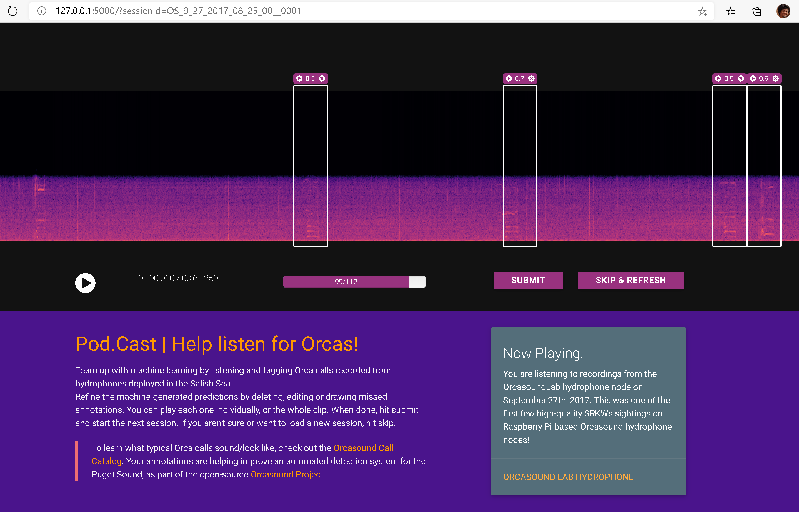
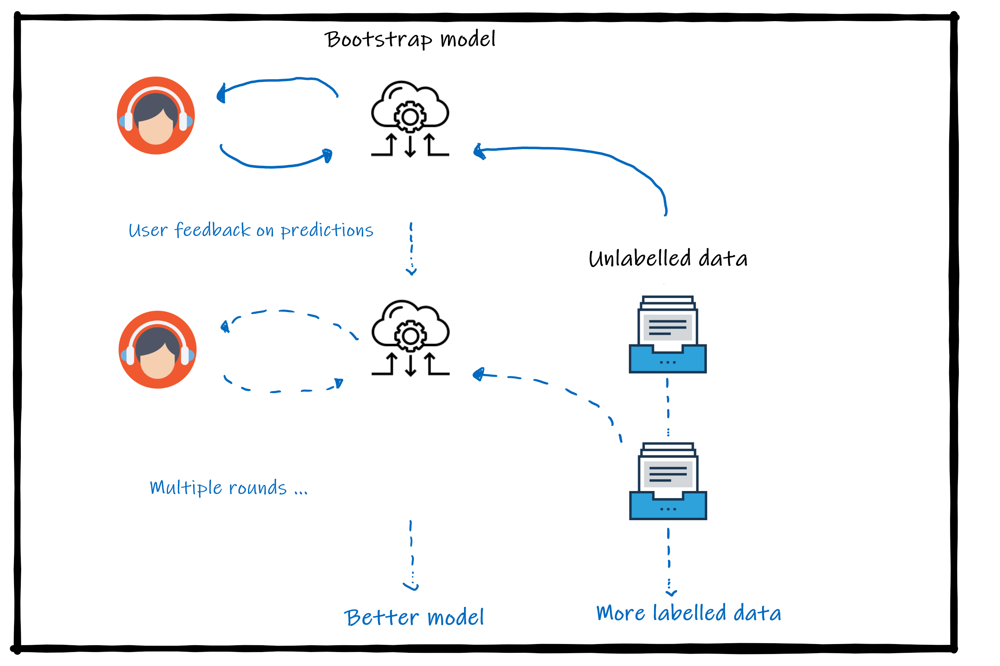
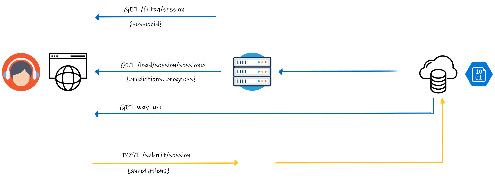
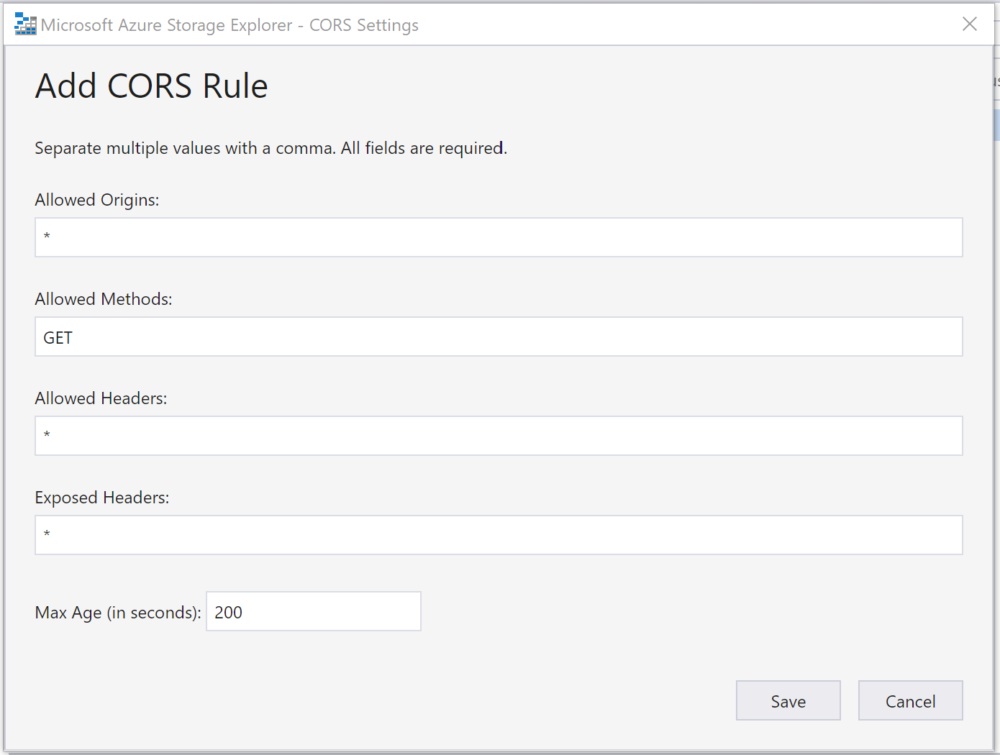
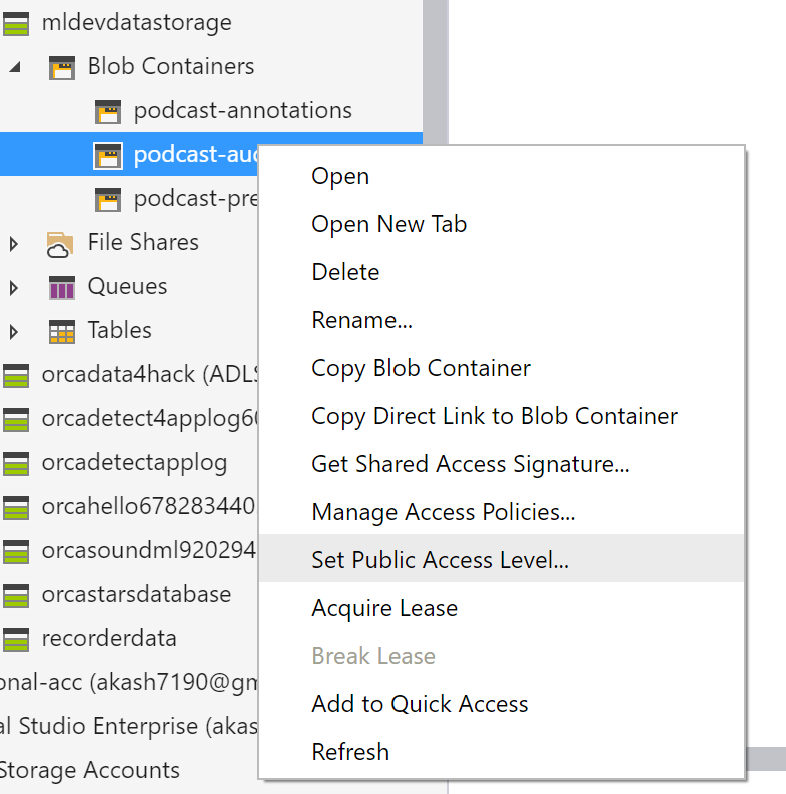

# Pod.Cast 🎱 🐋 | Annotation system 

[](https://github.com/orcasound/orcalabel-podcast/blob/master/LICENSE)

>Developed by Prakruti Gogia, Akash Mahajan and Nithya Govindarajan during Microsoft AI4Earth & OneWeek hackathons. *(this is volunteer-driven & is not an official product)* 

## Overview 

`podcast_server.py` is a prototype flask-based web-app to label unlabelled bioacoustic recordings, while viewing predictions from a model. This is useful to setup some quick-and-dirty labelling sessions that don't need any advanced features such as automated model inference, user access roles, interfacing with other backends, gamification etc.  

(See [prediction-explorer](README_prediction-explorer.md) for a related tool to quickly visualize & browse model predictions on a set of audio files. This runs locally)



- Each page/session gets a unique URL (via the `sessionid` URL param), that you can use to share if you find something interesting 
- Refer to the instructions on the page for how to edit model predictions or create annotations 
- The progress bar tracks the current "round" of unlabelled sessions for which annotations have been submitted  
- If you aren't sure, or want to see a new one, `skip & refresh` loads a random (un-annotated) session without submitting anything 

## Dataset Creation

This tool has been used in an active learning style to create & release new training & test sets at [orcadata/wiki](https://github.com/orcasound/orcadata/wiki/Pod.Cast-data-archive). 

- To do so, we process 2-3hr windows of unlabelled Orcasound archives where likely activity has been reported & upload them to the Pod.Cast tool:
    - Audio is split into 1-minute sessions that are easy to view 
    - Sessions to be labelled are chosen which contain positive predictions from ML model (tuned for high recall, so as to not miss anything)  
    - Sessions to be used as negative examples are also selected by choosing those with no predictions (tuned with a very low confidence threshold, so mistakes are very unlikely) 
- Each round generates new labelled data that improves models trained on this data, making them more robust to varied acoustic conditions at different hydrophone nodes. 
- Held-out test sets have also created in a similar fashion as accuracy and robustness benchmarks. 



## Architecture  

This prototype is a [single page application](https://love2dev.com/blog/5-single-page-app-best-practices/) with a simple flask backend that interfaces with Azure blob storage. 
For simplicity/ease of access, this version doubles up use of blob storage as a *sort of database*. A JSON file acts as a single entry, and separate containers as *sort of tables/collections* *(for now for this hack makes it easy to do quick-and-dirty viewing/editing in [Azure Storage Explorer](https://azure.microsoft.com/en-us/features/storage-explorer/), or any equivalent blob viewer for S3 etc.).* 



**Backend API:**

> GET /fetch/session

Scans the `getcontainer` blob for an unlabelled session, randomly picks & returns a `{sessionid=X}` response. The sessionid is simply the name of the corresponding X.JSON file on the blob.   

> GET /load/session/sessionid
>
> GET Azure blob wav

Fetches the corresponding JSON file from the `getcontainer` blob. (For an example, see [example-load.json](doc/example-load.json))

`backend_state` is used to populate the progress bar, and the client loads audio pointed at `uri` directly from the blob storage.   

> POST /submit/session

Writes a JSON to the `postcontainer` blob. (For an example, see [example-submit.json](doc/example-submit.json), it has the same schema)

**Client logic:**

Primary logic is defined in [main.js](static/js/src/main.js). 
- `fetchUrl, dataUrl, postUrl` in index.html define above API 
- The client first checks for the `sessionid` URL parameter & runs `loadSession` or `fetchAndLoadSession` as appropriate 
- This is done on page load and when a submit/skip button is clicked 

# Use & setup  

## Setup & local debugging  

1. Create an isolated python environment, and `pip install --upgrade pip && pip install -r requirements.txt`. 
(Python 3.6.8 has been tested, though recent versions should likely work as dependencies are quite simple)

2. Set the environment variable `FLASK_APP=podcast_server.py` and `FLASK_ENV=development`. If you haven't made your own CREDS file yet, see #3. Once that's done from this directory start the server with `python -m flask run`, and browse to the link in the terminal (e.g. `http://127.0.0.1:5000/`) in your browser (Edge and Chrome are tested). 

3. The `CREDS.yaml` specifies how the backend authenticates with blob storage & the specific container names to use. The provided file is a template and should be replaced: 
    * If you would like to test with an ongoing Pod.Cast round, ask for the credentials on the [Orcasound slack](https://join.slack.com/t/orcasound/shared_invite/zt-bd1jk2q9-FjeWr3OzocDBwDgS0g1FdQ)
    * If you are using your own blob account, see section [Using your own blob storage](#using-your-own-blob-storage)

> Note that when you run this locally, you will still be connecting & writing to the actual blob storage specified in `CREDS.yaml` so be careful. 

## Using your own blob storage

This assumes you have already created an Azure Storage account & know how to view & access it using [Azure Storage Explorer](https://azure.microsoft.com/en-us/features/storage-explorer/). 

1. Enable a [CORS rule](https://www.dougv.com/2016/08/serving-static-files-azure-storage-cors-rules/) to the account. In short, setting this allows a browser client to directly make a request to the blob storage to retrieve a *.wav file. 



2. Make sure you have 3 containers; `[1]: audiocontainer` *.wav audio files (~1min duration - as each file forms one page/session) `[2]: getcontainer` model predictions specified in JSON format [example-load.json](doc/example-load.json) corresponding to each *.wav file `[3]: postcontainer` destination for user-submitted annotations in JSON format [example-submit.json](doc/example-submit.json). 

3. Enable public read-only access to blobs in `audiocontainer` (select the "blobs" option). Along with #1, this is required for the browser to directly retrieve *.wav files. 



## Deployment to Azure App Service

Prerequsite: [Install Azure CLI](https://docs.microsoft.com/en-us/cli/azure/install-azure-cli?view=azure-cli-latest)

1. Authenticate and setup your local environment to be using the right subscription 

```
az login 
az account list --output table 
az account set --subscription SUBSCRIPTIONID
```

2. In the root directory of your application, create a deployment config file at `.azure/config`. This contains details about your resource group, appservice plan to use, etc. (An example file is at [.azure/config](/.azure/config))

3. Now run the following commands to deploy the app. The first command packages up your local directory into a *.zip for deployment and deploys the app on Azure. If an app with the same name in the deployment config file exists it will update it, else create a new app. The second command is to only be run the first time, to register the entry point of the app. (see note below)

```
az webapp up --sku B1 --dryrun
az webapp config set -g mldev -n aifororcas-podcast --startup-file "gunicorn --bind=0.0.0.0 --timeout 600 podcast_server:app"
```

> This deployment example is loosely based on the [Quickstart](https://docs.microsoft.com/en-us/azure/app-service/containers/quickstart-python?tabs=bash). We make a change to the [startup command](https://docs.microsoft.com/en-us/azure/app-service/containers/how-to-configure-python#customize-startup-command) to register the different name of our app file `podcast_server.py`. 
> (FYI some more details about the CLI commands used here are at: [az-webapp-up](https://docs.microsoft.com/en-us/cli/azure/webapp?view=azure-cli-latest#az-webapp-up), [configuring-python-app](https://docs.microsoft.com/en-us/azure/app-service/containers/how-to-configure-python))


## References 

This code uses a fork of [audio-annotator](https://github.com/CrowdCurio/audio-annotator) for the frontend code. audio-annotator uses [wavesurfer.js](https://github.com/katspaugh/wavesurfer.js) for rendering/playing audio. Please refer to respective references for more info on the core functions/classes used in this repo.
*(Note: the wavesurfer.js version used here is older than the current docs).*

