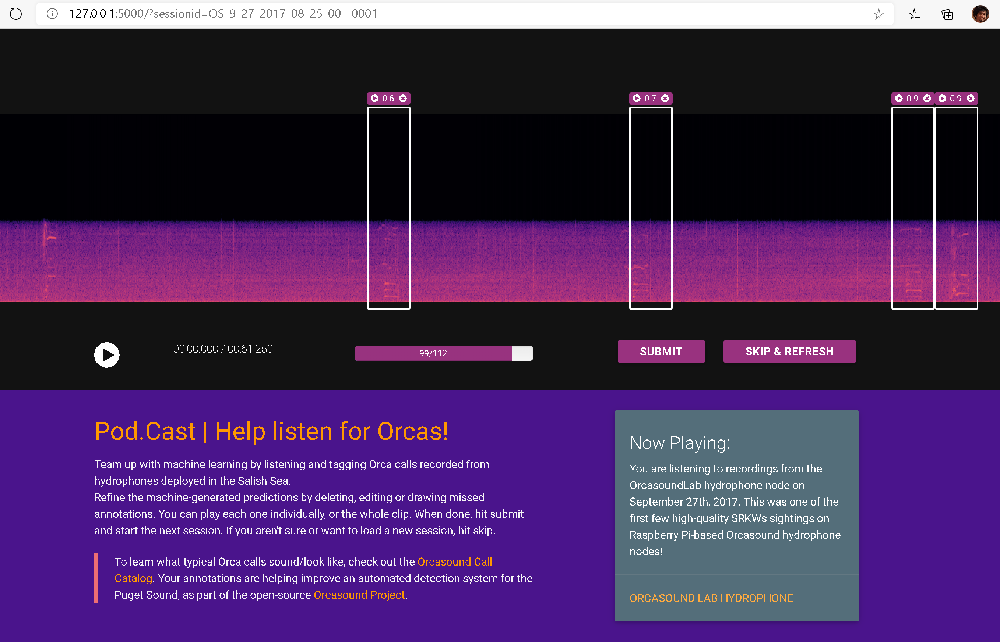
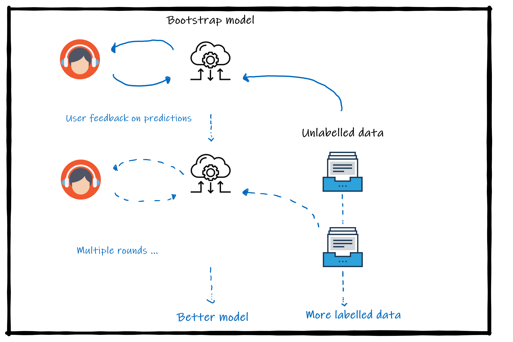
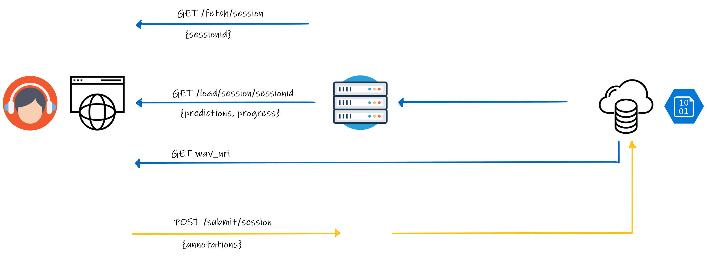

# Pod.Cast annotation system 

## Overview 

This is a prototype flask-based web-app to label unlabelled bioacoustic recordings, while viewing predictions from a model. This is useful to setup some quick-and-dirty labelling or exploration, that doesn't need any advanced features such as automated model inference, user access roles, interfacing with other backends, gamification etc.  

- Each page/session gets a unique URL (via the `sessionid` URL param), that you can use to share if you find something interesting 
- Refer to the instructions on the page for how to edit model predictions or create annotations 
- The progress bar tracks the current "round" of unlabelled sessions for whom annotations have been submitted  
- If you aren't sure, or want to see a new one, `skip & refresh` loads a random (un-annotated) session without submitting anything 

## Dataset Creation

This tool has been used in an active learning style to create & release new training & test sets at [orcadata/wiki](https://github.com/orcasound/orcadata/wiki/Pod.Cast-data-archive). 

- To do so, we process 2-3hr windows of unlabelled Orcasound archives where likely activity has been reported & upload them to the Pod.Cast tool:
    - Audio is split into 1-minute sessions that are easy to view 
    - Sessions to be labelled are chosen which contain positive predictions from ML model (tuned for high recall, so as to not miss anything)  
    - Sessions to be used as negative examples are also selected by choosing those with no predictions (tuned with a very low confidence threshold, so mistakes are very unlikely) 
- Each round generates new labelled data that improves models trained on this data, making them more robust to varied acoustic conditions at different hydrophone nodes. 
- Held-out test sets have also created in a similar fashion as accuracy and robustness benchmarks. 

## Architecture  

This prototype is a [single page application](https://love2dev.com/blog/5-single-page-app-best-practices/) with a simple flask backend that interfaces with Azure blob storage. 
For simplicity/ease of access, this version doubles up use of blob storage as a *sort of database*. A JSON file acts as a single entry, and separate containers as *sort of tables/collections* *(for now for this hack makes it easy to do quick-and-dirty viewing/editing in [Azure Storage Explorer](https://azure.microsoft.com/en-us/features/storage-explorer/), or any equivalent blob viewer for S3 etc.).* 

The API consists of the following: 

> GET /fetch/session

Scans the blob container for an unlabelled session, randomly picks & returns a sessionid. The sessionid is simply the name of the corresponding JSON file & if you see, gets appended to the URL. 

> GET /load/session/sessionid
>
> GET Azure blob wav

Fetches the corresponding JSON file from the blob container. 

> POST /submit/session

Schema of JSON entries 

Cite wavesurfer and audio-annotator 

# Use & setup  

## Setup & local debugging  

1. Create an isolated python environment, and `pip install --upgrade pip && pip install -r requirements.txt`. 
(Python 3.6.8 has been tested, though recent versions should likely work as dependencies are quite simple)

2. Set the environment variable `FLASK_APP=podcast_server.py` and `FLASK_ENV=development`. If you haven't made your own CREDS file yet, see #3. Once that's done from this directory start the server with `python -m flask run`, and browse to the link in the terminal (e.g. `http://127.0.0.1:5000/`) in your browser (Edge and Chrome are tested). 

3. The `CREDS.yaml` specifies how the backend authenticates with blob storage & the specific container names to use. The provided file is a template and should be replaced: 
    * If you would like to test with an ongoing Pod.Cast round, ask for the credentials on the [Orcasound slack](https://join.slack.com/t/orcasound/shared_invite/zt-bd1jk2q9-FjeWr3OzocDBwDgS0g1FdQ)
    * If you are using your own blob account, make sure you have 3 containers: `[1]` *.wav audio files (~1min duration - as each file forms one page/session) `[2]: getcontainer` model predictions specified in JSON format @ [ADDEXAMPLEFILE1] corresponding to each *.wav file `[3]: postcontainer` destination for user-submitted annotations in JSON format @ [ADDEXAMPLEFILE2] 

> Note that when you run this locally, you will still be connecting & writing to the actual blob storage specified in `CREDS.yaml` so be careful. 

4. For a modification of this code, to make it easier to explore/debug model predictions on some local wav files, see `prediction_explorer`. 

## References 

This code uses a fork of [audio-annotator](https://github.com/CrowdCurio/audio-annotator) for the frontend code. audio-annotator uses [wavesurfer.js](https://github.com/katspaugh/wavesurfer.js) for rendering/playing audio. Please refer to respective references for more info on the core functions/classes used in this repo.
*(Note: the wavesurfer.js version used here is older than the current docs).*

